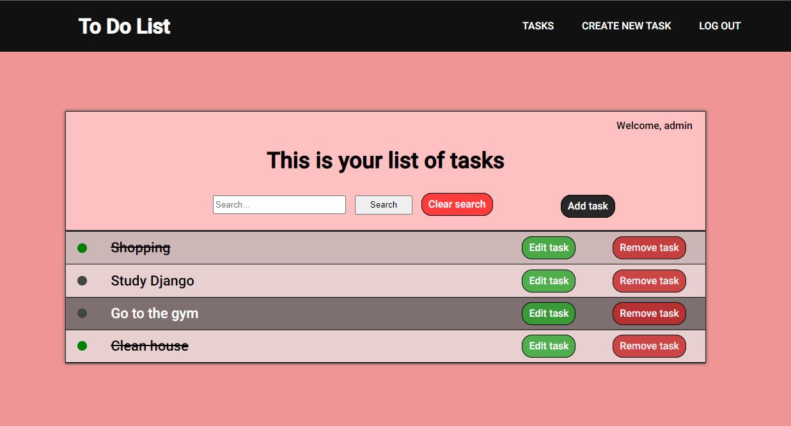
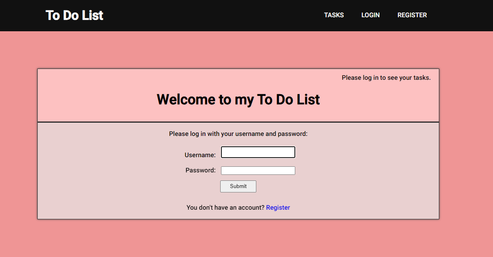

<header>
    <h1>To Do List 📝</h1>
</header>

    
This project focuses in CRUD operations. With this application, you are able to create, search, edit and delete a task. It also supports user registration and authentication, so that a user can only see his tasks and not other's. 
    

    
Here are some spoilers on what you can expect:

      
     &emsp;&emsp;&emsp;
    
      
    

<section>
    <h2>Technologies 🧑‍💻</h2>
    
These are the technologies used in this project:

    <ul>
        <li>Python</li>
        <li>Django</li>
        <li>SQLite3</li>
        <li>HTML</li>
        <li>CSS</li>
    </ul>

</section>

<section>
    <h2>How to make it work 🔧</h2>
    
In this section I will show step by step how to make this code work:

    <ol>
        <li>Use <code>git clone</code> to clone the repository or download the <code>ToDoList</code> directory. After that, open an editor and navigate to the project directory where the <code>ToDoList</code> directory is. Then create a virtual environment with:  
        <ul>
            <li><code>pip install virtualenv</code>  </li>
            <li><code>virtualenv venv</code>  </li>
        </ul>
        After that, activate the virtual environment and use this command to install the requirements to make the project work properly:  
        <ul>
            <li><code>pip install -r requirements.txt</code>  </li>
        </ul>
        It should look something like this:
          
        
          
        </li>
        <li>The next step is to manage the database. To create a <code>sqlite3</code> database, execute these commands before running the server:  
            <ul>
                <li><code>python manage.py makemigrations</code>  </li>
                <li><code>python manage.py migrate</code>  </li>
            </ul>
        </li>
        <li>To wrap things up, go to the <code>ToDoList/ToDoList</code> directory and open the <code>.env.txt</code> file. Here you have to replace the asigned values of the variables with your own data. For example:  
            <ul>
                <li>
                    In <code>SECRET_KEY=your_secret_key</code>, replace <code>your_secret_key</code> with your secret key, which you can generate by your own or use: 
                    <code>from django.core.management.utils import get_random_secret_key</code>.  
                </li>
                <li>
                    In <code>DEBUG=true_or_false</code>, replace <code>true_or_false</code> with the <code>True</code> or <code>False</code>, depending on what you want to do.  
                </li>
                <li>
                    In <code>TEMPLATES_DIR=templates_directory</code>, replace <code>templates_directory</code> with the path to the directory where you store your django templates.  
                </li>
                <li>
                    In <code>STATIC=static</code>, replace <code>static</code> with the path to the directory with the static files.  
                </li>
            </ul>
        ⚠️ To make these variables work, just <strong>delete</strong> the <code>.txt</code> extension of the file.  
        </li>  
        <li>Finally, if everything went right, you should be able to run the server and visualize the website and utilize its functionalities by using the command:  
            <ul>
                <li><code>python manage.py runserver</code>  </li>
            </ul>
        </li>
        <li>And that's all, you should be able to navigate and try the website with all of its functionallity 😉.  </li>
    </ol>
</section>

<section>
    <h2>
        Contact me:
    </h2>
    
In case you have any doubt or you are interested about my work, you can contact me here: 

    <ul>
        <li>My linkedin: </li>
        <li>My email: <a href="mailto:pedro.tobarra.leal@gmail.com">Pedro.tobarra.leal@gmail.com</a></li>
    </ul>
</section>
